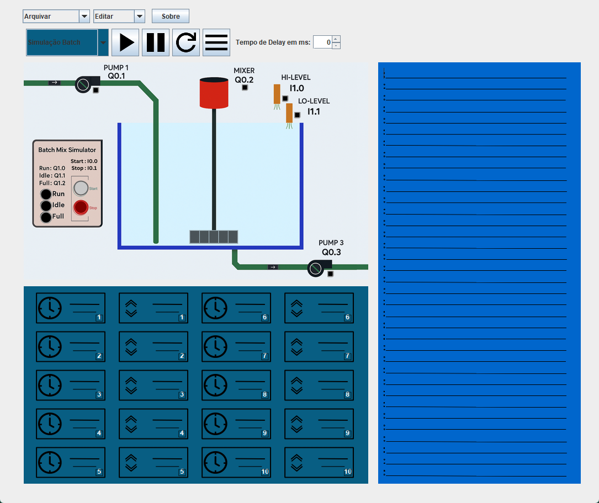

# 🤖 Simulador de CLP com Interface Interativa (Instruction List - IL)

📚 **Disciplina:** Controladores Lógicos Programáveis (CLP)

🎓 **Curso:** Engenharia de Computação

🏫 **Instituição:** IFTM - Instituto Federal do Triângulo Mineiro

📍 **Campus:** Uberaba - Parque Tecnológico

👨‍🏫 **Professor:** Robson Rodrigues

---

## 👥 Alunos

- [Yuri David Silva Duarte](https://github.com/Boyuridod)
- [Diogo Nunes Batista](https://github.com/Diogo-NB)
- [José Ferreira Arantes Lopes](https://github.com/JoseArantes83)
- [Vinícius Gabriel Ribeiro Barbosa](https://github.com/ViniciusGRBarbosa)

---

## 📌 Descrição Geral do Projeto

O projeto consiste na criação de um ambiente de simulação de um CLP (Controlador Lógico Programável) no computador, com interface interativa para operar as entradas e saídas disponíveis no simulador de processo industrial.

O ambiente segue o ciclo de funcionamento de um CLP real e se inspira em simuladores existentes, como o LogixPro.

O projeto se baseia na versão desenvolvida pelos alunos do semestre 2024/02, disponível neste repositório:
🔗 [Repositório base no GitHub](https://github.com/IasminPieraco/Trabalho-Final-CLP)

---

## 🛠️ Funcionalidades Obrigatórias

## 📝 Lista de Instruções Suportadas (Instruction List - IL)

- **LD:** Load – Carrega um valor para o acumulador.
- **LDN:** Load Negado – Carrega um valor negado para o acumulador.
- **ST:** Store – Armazena o conteúdo do acumulador no local especificado.
- **STN:** Store Negado – Armazena o conteúdo negado do acumulador no local especificado.
- **AND:** AND – Função booleana AND entre o operando indicado e o valor do acumulador.
- **ANDN:** AND Negado – Função booleana AND entre o operando indicado negado e o valor do acumulador.
- **OR:** OR – Função booleana OR entre o operando indicado e o valor do acumulador.
- **ORN:** OR Negado – Função booleana OR entre o operando indicado negado e o valor do acumulador.
- **TON:** Temporizador ON Delay – Ativa após um intervalo de tempo definido.
- **TOF:** Temporizador OFF Delay – Desativa após um intervalo de tempo definido.
- **CTU:** Count Up – Contador crescente.
- **CTD:** Count Down – Contador decrescente.
- **T1, T2, T3...:** Temporizadores – Referências aos temporizadores específicos.
- **I0.0, I1.7, I1.0...:** Entradas – Endereços das entradas do sistema.
- **Q0.1, Q1.7, Q1.0...:** Saídas – Endereços das saídas do sistema.
- **M1, M2, M3...:** Memórias – Memórias booleanas locais disponíveis.

---

### ✅ Data Table (Tabela de Variáveis)

- Uma ferramenta para visualizar todas as variáveis do sistema
  _(Inspirado na Data Table do LogixPro)_

### ✅ Modos de Operação

- 🛠️ **PROGRAM:** Permite edição do programa lógico, sem alterar saídas físicas.
- ⏸️ **STOP:** Programa do usuário parado.
- ▶️ **RUN:** Executa o programa lógico criado.

### ✅ Ciclo de Varredura do CLP Simulado

1. Inicializa o sistema
2. Lê as entradas e armazena na memória imagem
3. Processa o programa do usuário
4. Atualiza as saídas com base na memória imagem de saída
5. Retorna ao passo 2

### ✅ Salvamento e Carregamento de Programas

- Possibilidade de **salvar e carregar programas anteriores**

### ✅ Linguagem de Programação da Lógica do CLP

- **Instruction List (IL)**

### ✅ Exemplos de Programas

- 3 exemplos diferentes de código que utilizam:
  - Operações lógicas
  - Temporizadores
  - Contadores

### ✅ Instalador para Windows

- O simulador deve dispor de um **instalador executável (.exe) para ambiente Windows**

---

## 🎨 Interface Interativa - Preview

---

## ▶️ Vídeo de Demonstração

📺 Veja o simulador funcionando:
👉 [Assista no YouTube](https://www.youtube.com/watch?v=Qdy83gkzqz0)

---

## 📚 Referências

- Projeto base: [https://github.com/IasminPieraco/Trabalho-Final-CLP](https://github.com/IasminPieraco/Trabalho-Final-CLP)
- LogixPro Simulator: Referência visual
